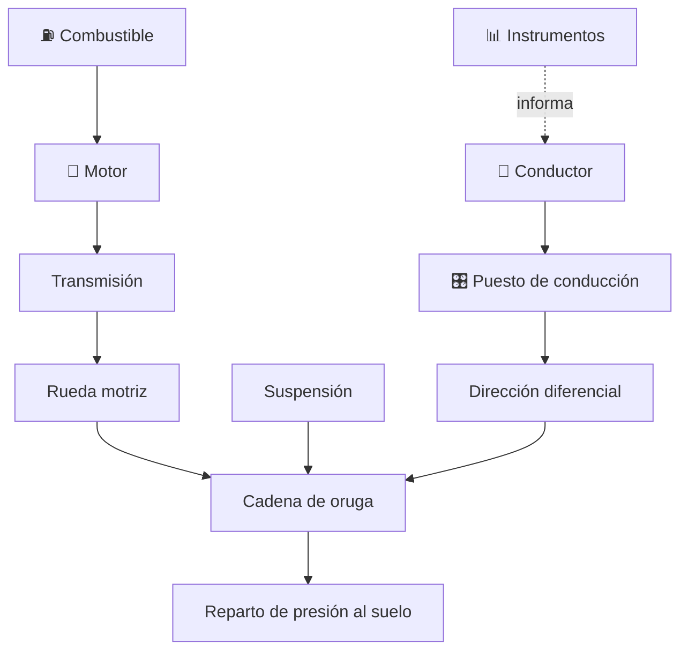

# 🪖 Curso: Tanques

[🏠 Inicio](../../README.md) · [🚙 Catálogo de vehículos](../README.md) · [🎓 Guía de curso](../../docs/08-guia-de-estilo-y-curso.md)

> **Curso de marco público e histórico.** Documenta el carro de combate solo
> desde la historia pública, la física general del vehículo con orugas y los
> principios de movilidad. **No** incluye táctica, sistemas de armas, blindaje
> ofensivo ni procedimientos operativos. Ver
> [🦺 docs/04-seguridad-y-limites.md](../../docs/04-seguridad-y-limites.md).

---

## 🎯 Objetivos de aprendizaje

Al terminar este curso deberías poder:

- Explicar como un vehículo de orugas se mueve, gira y reparte su peso al suelo.
- Conocer la historia pública del carro de combate y su evolución técnica.
- Identificar el tren de rodaje, la suspensión y la cadena cinemática general.
- Comprender la física de la movilidad: presión sobre el suelo y potencia/peso.
- Distinguir el marco institucional público (Ejército, Ley 18.948).
- Traducir la física del vehículo en variables de un simulador educativo.

---

## 🛡️ Alcance y límites

Este curso se mantiene en el **marco público y divulgativo**. Solo trata
historia pública, física del vehículo y principios de movilidad. Quedan
**fuera** los sistemas de armas, el blindaje ofensivo, la táctica, la doctrina y
los procedimientos operativos, según
[🦺 docs/04-seguridad-y-limites.md](../../docs/04-seguridad-y-limites.md). La
protección se menciona solo de forma divulgativa como masa que influye en la
movilidad.

---

## 🗺️ Mapa del vehículo

---

## 📚 Módulos del curso

| # | Módulo | Contenido | Enlace |
| :-: | --- | --- | --- |
| 1 | 📜 Historia | Historia pública del carro de combate, línea de tiempo. | [Abrir](historia/historia-tanque.md) |
| 2 | 📋 Características | Que es, tipos generales y para que se usa. | [Abrir](operacion/caracteristicas-tanque.md) |
| 3 | 🔧 Sistemas mecánicos | Tren de rodaje de orugas, suspensión, motor y movilidad. | [Abrir](operacion/sistemas-mecanicos-tanque.md) |
| 4 | 🎛️ Mandos e instrumentos | Puesto del conductor a nivel general educativo. | [Abrir](mandos/manual-mandos-tanque.md) |
| 5 | 🧪 Principios y operación | Física de la movilidad y fases generales. | [Abrir](operacion/principios-tanque.md) |
| 6 | 🌍 Entornos de trabajo | Terrenos, pendientes y obstáculos. | [Abrir](operacion/entornos-tanque.md) |
| 7 | ⚖️ Reglamentos | Marco institucional público (Ejército, Ley 18.948). | [Abrir](reglamentos/reglamentos-tanque.md) |
| 8 | 🎮 Diseño de simulación | Variables de movilidad, ciclo y modos educativos. | [Abrir](simulacion/diseno-simulador-tanque.md) |
| 9 | 🧰 Recursos | Glosario, enlaces y diagramas. | [Abrir](recursos/recursos-tanque.md) |

---

## 🧩 Requisitos previos

Ninguno específico. Ayuda haber visto antes un vehículo con motor y transmisión,
como los [🚗 automóviles](../automoviles/README.md), para entender la cadena
cinemática. Este curso la adapta al tren de rodaje de orugas desde un enfoque
solo divulgativo. Marco legal común en
[⚖️ docs/07-marco-legal-chile.md](../../docs/07-marco-legal-chile.md), sección
1.10 (tanques).

---

[➡️ Empezar por el Módulo 1: Historia](historia/historia-tanque.md)
