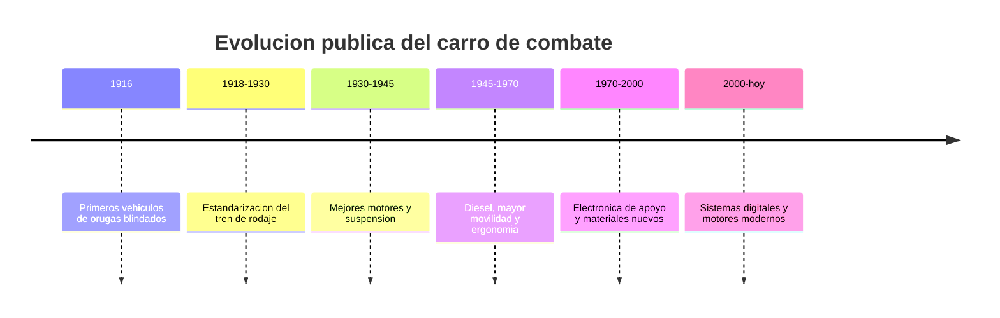

# 📜 Historia del tanque (marco público)

[🏠 Inicio](../../../README.md) · [🪖 Curso: Tanques](../README.md) · 📜 Historia

Historia pública y divulgativa. Solo evolución técnica general del vehículo, sin
táctica ni sistemas de armas. Ver
[`docs/04-seguridad-y-limites.md`](../../../docs/04-seguridad-y-limites.md).

## Origen

El carro de combate aparece a inicios del siglo XX como un vehículo capaz de
cruzar terreno difícil gracias a las orugas. La idea central, desde el punto de
vista técnico, es repartir el peso del vehículo sobre una gran superficie para
moverse por barro y obstáculos donde una rueda se hundiría.

## Línea de tiempo

| Periodo | Hito técnico público | Importancia |
| --- | --- | --- |
| 1916 | Primeros vehículos de orugas | Prueba del concepto de movilidad todo terreno. |
| 1918-1930 | Estandarización del tren de rodaje | Ruedas motriz, tensora y rodillos definidos. |
| 1930-1945 | Mejores motores y suspensión | Mayor velocidad y confort de marcha. |
| 1945-1970 | Motores diesel | Más autonomía y menor riesgo de incendio. |
| 1970-2000 | Electrónica de apoyo | Instrumentos y ayudas a la conducción. |
| 2000-presente | Sistemas digitales | Diagnóstico y gestión moderna del vehículo. |

## Evolución tecnológica (aspectos públicos)

- **Movilidad**: del paso lento a mayor velocidad y autonomía.
- **Suspensión**: de sistemas rígidos a barras de torsión e hidroneumaticas.
- **Motor**: de gasolina a diesel y turbina, buscando potencia/peso.
- **Ergonomia**: puestos más cómodos e instrumentos claros.
- **Materiales**: estructuras más eficientes en peso y rigidez.
- **Electrónica**: diagnóstico, sensores y ayudas a la conducción.

## Nota sobre alcance

Este módulo describe solo la evolución del **vehículo** como máquina de
movilidad. No trata armamento, blindaje ofensivo, táctica ni doctrina, en línea
con [`docs/04-seguridad-y-limites.md`](../../../docs/04-seguridad-y-limites.md).

## Fuentes

- Registrar aquí las fuentes públicas consultadas.
- Enlazar cada fuente también en [`manuales/fuentes.md`](../../../manuales/fuentes.md).

---

[🎓 Portada del curso](../README.md) · [➡️ Siguiente: Características](../operacion/caracteristicas-tanque.md)
