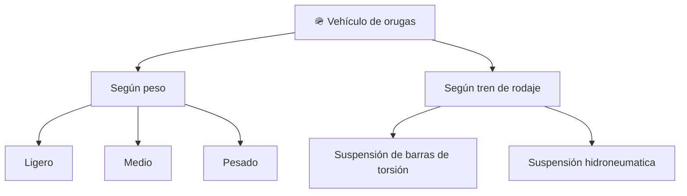

# 📋 Características funcionales del tanque (marco público)

[🏠 Inicio](../../../README.md) · [🪖 Curso: Tanques](../README.md) · 📋 Características

Que es un carro de combate como vehículo, que familias existen según su movilidad
y para que sirve el tren de orugas. Solo enfoque público y divulgativo; sin
armamento ni táctica. Este módulo da contexto antes de la mecánica (Módulo 3).

---

## 🧭 Definición

Un carro de combate es un vehículo terrestre de orugas, pesado y de alta
movilidad en terreno difícil. Desde el punto de vista técnico que trata este
curso, es una plataforma que reparte un gran peso sobre el suelo mediante orugas
para avanzar donde las ruedas se hundirían.

---

## 🧬 Características clave (aspectos públicos)

| Característica | Descripción |
| --- | --- |
| Tracción por orugas | Reparte el peso en una superficie amplia y da agarre en barro. |
| Baja presión sobre el suelo | Menor hundimiento que una rueda para el mismo peso. |
| Dirección diferencial | Gira frenando o acelerando una oruga respecto a la otra. |
| Alta masa | Gran peso que exige mucho motor y afecta la inercia. |
| Movilidad todo terreno | Supera pendientes, zanjas y obstáculos. |
| Protección como masa | El blindaje se menciona solo como peso que influye en la movilidad. |

---

## 🗂️ Familias por movilidad

| Familia | Rasgo de movilidad | Nota |
| --- | --- | --- |
| Ligero | Más velocidad y menos presión al suelo | Mejor en terreno blando. |
| Medio | Equilibrio entre peso y movilidad | Uso general histórico. |
| Pesado | Más masa y menos agilidad | Exige más motor y consumo. |
| Suspensión de torsión | Marcha robusta y sencilla | Muy común históricamente. |
| Suspensión hidroneumatica | Mejor confort y control de altura | Solución más moderna. |

---

## 🎯 Para qué se usa (enfoque público)

- Movilidad en terreno difícil donde una rueda se hundiría.
- Estudio de la física de vehículos de orugas.
- Contexto histórico e institucional público.
- Simulación educativa de conducción todo terreno, sin contenido sensible.

---

[⬅️ Anterior: Historia](../historia/historia-tanque.md) · [➡️ Siguiente: Sistemas mecánicos](sistemas-mecanicos-tanque.md)
