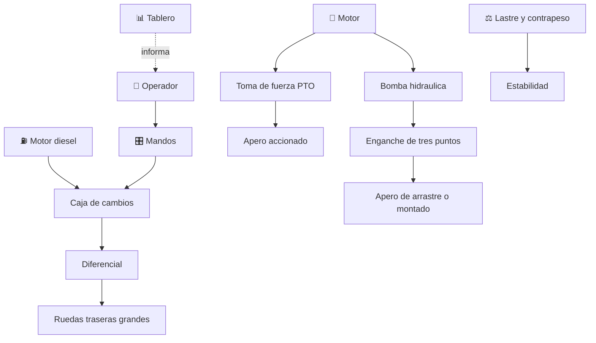

# 🚜 Curso: Tractores

[🏠 Inicio](../../README.md) · [🚙 Catalogo de vehiculos](../README.md) · [🎓 Guia de curso](../../docs/08-guia-de-estilo-y-curso.md)

> **Curso completo del tractor agricola.** Documenta la maquina de principio a
> fin: historia, caracteristicas, mecanica en profundidad, mandos, fisica de la
> traccion y la estabilidad, entornos, reglamentos chilenos y diseno de
> simulacion. El nucleo del curso es la toma de fuerza, el enganche de tres
> puntos y la estabilidad en pendiente.

---

## 🎯 Objetivos de aprendizaje

Al terminar este curso deberias poder:

- Explicar como un tractor tracciona, tira de aperos y transmite fuerza al campo.
- Identificar sus sistemas mecanicos, la toma de fuerza y el enganche de tres puntos.
- Comprender la hidraulica, el lastre y la estabilidad en pendiente.
- Reconocer todos los mandos e instrumentos y su funcion.
- Conocer los reglamentos chilenos aplicables (licencia clase D, seguridad).
- Traducir todo lo anterior en variables de un simulador educativo.

---

## 🗺️ Mapa del vehiculo

---

## 📚 Modulos del curso

| # | Modulo | Contenido | Enlace |
| :-: | --- | --- | --- |
| 1 | 📜 Historia | Origen y evolucion del tractor, linea de tiempo. | [Abrir](historia/historia-tractor.md) |
| 2 | 📋 Caracteristicas | Que es, tipos de tractor y para que sirve cada uno. | [Abrir](operacion/caracteristicas-tractor.md) |
| 3 | 🔧 Sistemas mecanicos | Motor diesel, PTO, tres puntos, hidraulica, lastre. | [Abrir](operacion/sistemas-mecanicos-tractor.md) |
| 4 | 🎛️ Mandos e instrumentos | Cabina, controles, mandos hidraulicos y tablero. | [Abrir](mandos/manual-mandos-tractor.md) |
| 5 | 🧪 Principios y operacion | Traccion, patinaje, estabilidad y fases de trabajo. | [Abrir](operacion/principios-tractor.md) |
| 6 | 🌍 Entornos de trabajo | Campo, pendiente, camino rural y faena. | [Abrir](operacion/entornos-tractor.md) |
| 7 | ⚖️ Reglamentos | Ley chilena: licencia clase D, seguridad agricola. | [Abrir](reglamentos/reglamentos-tractor.md) |
| 8 | 🎮 Diseno de simulacion | Variables, ciclo y modos de juego. | [Abrir](simulacion/diseno-simulador-tractor.md) |
| 9 | 🧰 Recursos | Glosario, enlaces y diagramas. | [Abrir](recursos/recursos-tractor.md) |

---

## 🧩 Requisitos previos

Se recomienda haber revisado antes el [curso de motos](../motos/README.md) para
los conceptos base de propulsion y transmision. El tractor agrega la toma de
fuerza, el enganche de tres puntos, la hidraulica de trabajo y una estabilidad
muy sensible a la pendiente y al lastre. Marco legal comun en
[⚖️ docs/07-marco-legal-chile.md](../../docs/07-marco-legal-chile.md).

---

[➡️ Empezar por el Modulo 1: Historia](historia/historia-tractor.md)
