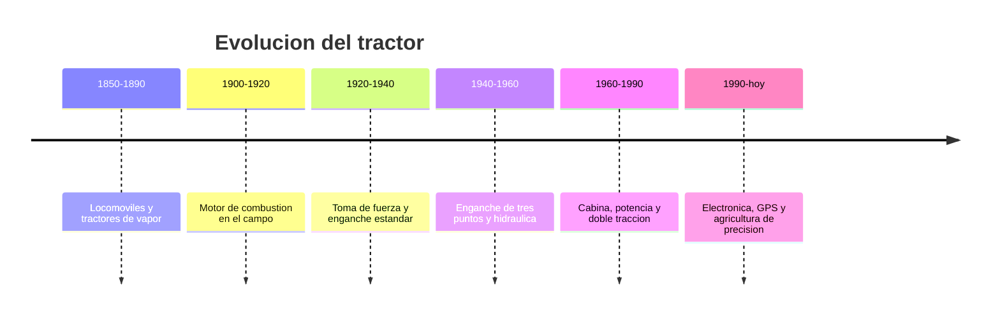

# 📜 Historia del tractor

[🏠 Inicio](../../../README.md) · [🚜 Curso: Tractores](../README.md) · 📜 Historia

## Origen

El tractor nace para reemplazar la fuerza animal en las labores del campo. Los
primeros ingenios fueron locomoviles de vapor, pesados y dificiles de maniobrar.
El motor de combustion, mas ligero, los hizo practicos a comienzos del siglo XX.
El gran salto llego con el **enganche de tres puntos** y la hidraulica, que
convirtieron al tractor en una plataforma capaz de accionar y transportar
multiples aperos.

## Linea de tiempo

| Periodo | Hito | Importancia |
| --- | --- | --- |
| 1850-1890 | Locomoviles y tractores de vapor | Primer intento de mecanizar el campo. |
| 1900-1920 | Motor de combustion en el campo | Maquina mas ligera y manejable. |
| 1920-1940 | Toma de fuerza y enganche estandar | El tractor acciona aperos, no solo tira. |
| 1940-1960 | Enganche de tres puntos y hidraulica | Control de aperos y transferencia de peso. |
| 1960-1990 | Cabina, potencia y doble traccion | Confort, seguridad y mas agarre. |
| 1990-presente | Electronica, GPS y precision | Guiado automatico y dosis exactas. |

## Evolucion tecnologica

- **Fuerza**: del vapor al diesel de alto par y baja velocidad de giro.
- **Enganche**: del arrastre simple al enganche de tres puntos con control hidraulico.
- **Toma de fuerza**: aparicion del eje PTO normalizado para accionar aperos.
- **Traccion**: de una sola rueda motriz a la doble traccion y las orugas de goma.
- **Cabina**: aparicion de la estructura antivuelco (ROPS) y la cabina cerrada.
- **Precision**: guiado por GPS, control de dosis y telemetria de la maquina.

## Tipos representativos

| Tipo | Uso tipico | Caracteristica destacada |
| --- | --- | --- |
| Tractor utilitario | Tareas generales de campo | Versatil, potencia media. |
| Tractor de alta potencia | Labranza pesada | Doble traccion, gran par. |
| Tractor fruticola / vina | Hileras estrechas | Chasis angosto y bajo. |
| Tractor de orugas | Suelos blandos o en pendiente | Reparte el peso, mucho agarre. |
| Tractor articulado | Grandes extensiones | Se pliega en el centro para girar. |

## Impacto en la agricultura

El tractor es la maquina que mecanizo la agricultura y multiplico la superficie
que una persona puede trabajar. Al accionar aperos por la toma de fuerza y
manejarlos con la hidraulica, se convirtio en la plataforma central de la faena
agricola. Su evolucion actual apunta a la precision: hacer mas con menos insumos
y con menor impacto sobre el suelo.

## Fuentes

- Registrar aqui las fuentes publicas consultadas.
- Enlazar cada fuente tambien en [`manuales/fuentes.md`](../../../manuales/fuentes.md).

---

[🎓 Portada del curso](../README.md) · [➡️ Siguiente: Caracteristicas](../operacion/caracteristicas-tractor.md)
