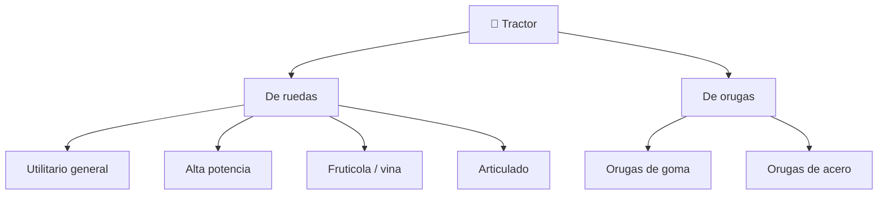

# 📋 Caracteristicas funcionales del tractor

[🏠 Inicio](../../../README.md) · [🚜 Curso: Tractores](../README.md) · 📋 Caracteristicas

Que es un tractor, que tipos existen y para que sirve cada uno. Este modulo da el
contexto antes de abrir la mecanica (Modulo 3).

---

## 🧭 Definicion

Un tractor es una maquina automotriz disenada para entregar fuerza de traccion y
para accionar aperos en el campo. No busca velocidad, sino **par**: mucha fuerza
a bajas vueltas para tirar de arados, arrastrar remolques y mover implementos a
traves de la toma de fuerza. Se distingue por sus grandes ruedas traseras, su
enganche de tres puntos y su capacidad de recibir lastre para mejorar el agarre.

---

## 🧬 Caracteristicas clave

| Caracteristica | Descripcion |
| --- | --- |
| Par elevado | Entrega mucha fuerza a bajas vueltas para tirar y accionar. |
| Toma de fuerza | Un eje transmite la potencia del motor a los aperos. |
| Enganche de tres puntos | Sujeta y controla la altura de aperos montados. |
| Hidraulica de trabajo | Levanta aperos y alimenta accesorios externos. |
| Lastre y contrapeso | Peso agregado que mejora el agarre y equilibra el apero. |
| Estabilidad sensible | Centro de gravedad alto; riesgo de vuelco en pendiente. |

---

## 🗂️ Tipos de tractor

| Tipo | Uso tipico | Rasgo destacado |
| --- | --- | --- |
| Utilitario | Tareas generales | Versatil, potencia media. |
| Alta potencia | Labranza pesada | Doble traccion, gran par. |
| Fruticola / vina | Hileras estrechas | Chasis angosto y bajo. |
| Articulado | Grandes extensiones | Se pliega en el centro para girar. |
| De orugas | Suelos blandos o en pendiente | Reparte el peso, mucho agarre. |

---

## 🎯 Para que se usa

- Labranza: arar, rastrear y preparar el suelo.
- Siembra y aplicacion de insumos con aperos accionados por la PTO.
- Cosecha y transporte de productos con remolque.
- Trabajo con implementos: pala cargadora frontal, retro, cortadora.
- Tareas fuera de la agricultura: mantenimiento de caminos, jardineria pesada.

---

[⬅️ Anterior: Historia](../historia/historia-tractor.md) · [➡️ Siguiente: Sistemas mecanicos](sistemas-mecanicos-tractor.md)
