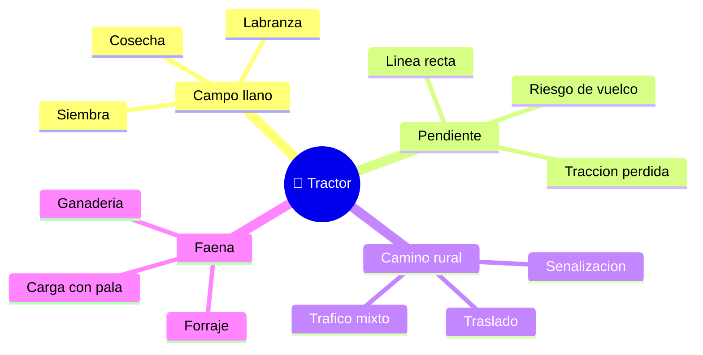

# 🌍 Entornos de trabajo del tractor

[🏠 Inicio](../../../README.md) · [🚜 Curso: Tractores](../README.md) · 🌍 Entornos

Donde opera un tractor y como cambia la conduccion segun el entorno. Cada entorno
implica reglas, riesgos y ajustes distintos, y en simulacion se traduce en
escenarios diferentes.

---

## 🗺️ Entornos principales

| Entorno | Caracteristicas | Riesgos tipicos | Ajuste de conduccion |
| --- | --- | --- | --- |
| Campo llano | Labranza, siembra, cosecha. | Polvo, obstaculos ocultos. | Regimen de PTO estable, avance parejo. |
| Pendiente | Terreno inclinado. | Vuelco lateral o hacia atras. | Subir en linea recta, baja velocidad. |
| Suelo blando / barro | Poca firmeza, patinaje. | Empantanamiento, perdida de traccion. | Doble traccion, lastre, bloqueo de diferencial. |
| Camino rural | Traslado entre predios. | Trafico mixto, baja visibilidad. | Frenos unidos, luces, apero trabado. |
| Faena ganadera / forraje | Carga y transporte. | Atrapamiento con la PTO. | Protector de PTO, area despejada. |

---

## 🌦️ Factores del entorno

- **Pendiente**: es el factor de riesgo principal por el vuelco del tractor.
- **Humedad del suelo**: define el agarre; el barro exige lastre y doble traccion.
- **Tipo de labor**: labranza pide fuerza; transporte pide velocidad moderada.
- **Trafico**: al circular por camino publico convive con otros vehiculos.
- **Clima**: lluvia y polvo afectan visibilidad, agarre y confort.

---

## 🎮 Traduccion a simulacion

Cada entorno es un escenario con su pendiente, tipo de suelo, labor y clima. Ver
como se modela en el
[Modulo 8: Diseno de simulacion](../simulacion/diseno-simulador-tractor.md).

---

[⬅️ Anterior: Principios y operacion](principios-tractor.md) · [➡️ Siguiente: Reglamentos](../reglamentos/reglamentos-tractor.md)
