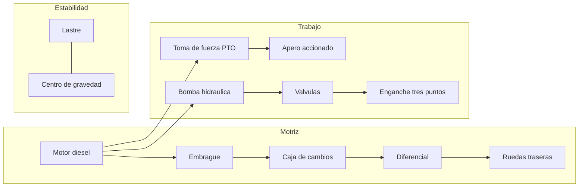
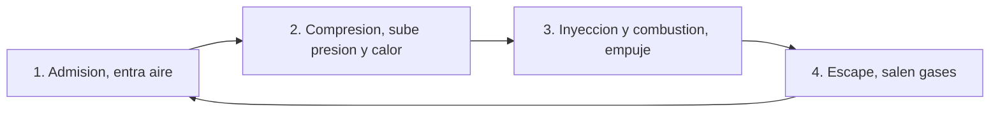
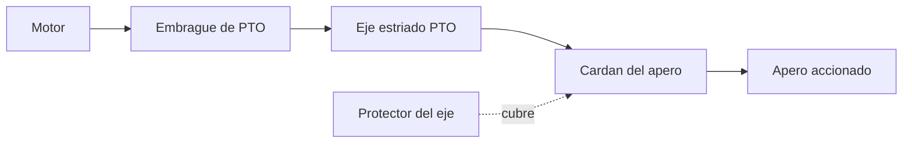
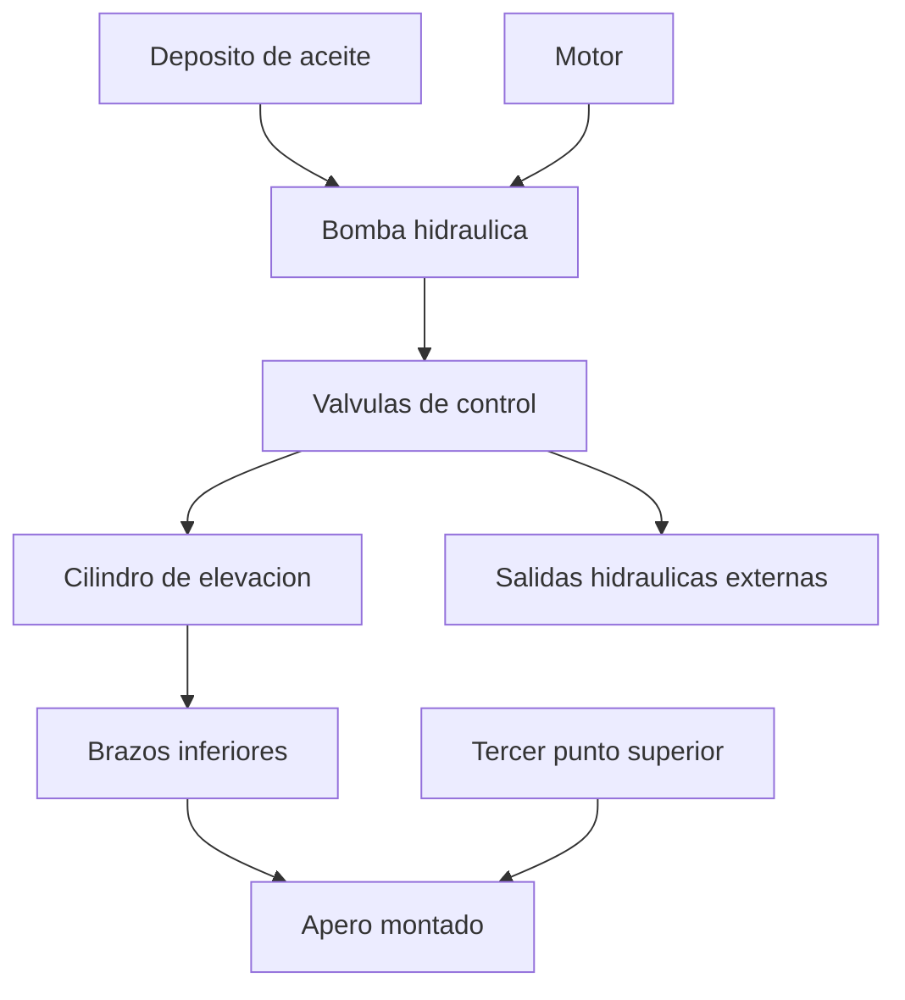
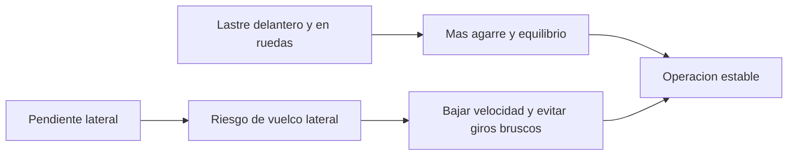

# 🔧 Sistemas mecanicos del tractor

[🏠 Inicio](../../../README.md) · [🚜 Curso: Tractores](../README.md) · 🔧 Sistemas mecanicos

Este modulo abre el tractor por dentro y es el corazon del curso. Explica cada
sistema, como funciona y como se conecta con los demas, con foco en la toma de
fuerza, el enganche de tres puntos, la hidraulica y la estabilidad. Es la base
tecnica para entender los mandos (Modulo 4) y la fisica del trabajo (Modulo 5).

---

## 1. ⚙️ Motor diesel

El tractor usa un **motor diesel** por su alto par a bajas vueltas y su bajo
consumo, ideal para tirar de aperos durante horas. A diferencia de un automovil,
el tractor trabaja largos periodos a regimen constante, moviendo la PTO o
traccionando bajo carga.

| Parametro | Efecto en el tractor |
| --- | --- |
| Par (torque) | Fuerza de tiro y de arrastre de aperos pesados. |
| Potencia (kW/CV) | Capacidad de mantener el trabajo bajo carga. |
| Regimen de PTO | Vueltas del motor que dan las 540 o 1000 rpm de la PTO. |
| Consumo | Determina la autonomia en una jornada de campo. |

Sistemas de apoyo: inyeccion diesel, refrigeracion por liquido, filtrado
reforzado de aire (mucho polvo en el campo) y, en modelos modernos,
postratamiento de gases.

---

## 2. 🔩 Toma de fuerza (PTO)

La **toma de fuerza** o Power Take-Off es un eje estriado que sale del tractor y
transmite la potencia del motor directamente al apero: una segadora, una bomba,
un remolque esparcidor. Es lo que diferencia al tractor de un simple vehiculo de
tiro.

| Concepto | Descripcion |
| --- | --- |
| Regimen normalizado | 540 rpm o 1000 rpm segun el apero. |
| Embrague de PTO | Conecta y desconecta el eje sin detener el tractor. |
| Cardan con junta | Transmite el giro al apero permitiendo movimiento. |
| Protector | Cubierta que evita el atrapamiento; nunca debe faltar. |

Seguridad critica: el eje de la PTO gira a gran velocidad y ha causado accidentes
graves por atrapamiento de ropa. El protector debe estar siempre colocado y el
operador nunca debe acercarse con la PTO en marcha.

---

## 3. 🔺 Enganche de tres puntos e hidraulica

El **enganche de tres puntos** es un triangulo formado por dos brazos inferiores
y un brazo superior (tercer punto) que sujeta el apero montado. La hidraulica
sube y baja ese enganche, controlando la profundidad de trabajo.

| Elemento | Funcion |
| --- | --- |
| Brazos inferiores | Sostienen el apero y transmiten el tiro. |
| Tercer punto | Fija el angulo del apero y su inclinacion. |
| Cilindro hidraulico | Sube y baja el enganche para regular la profundidad. |
| Control de esfuerzo | Ajusta la altura segun la resistencia del suelo. |
| Salidas externas | Alimentan cilindros de aperos remolcados. |

- **Transferencia de peso**: al levantar un apero de tiro, parte de su peso se
  traslada a las ruedas traseras del tractor y mejora el agarre.
- **Control de posicion**: mantiene el apero a una altura fija.
- **Control de esfuerzo**: sube el apero cuando la resistencia del suelo aumenta,
  evitando que el motor se ahogue y regulando la traccion.

---

## 4. 🔗 Transmision y traccion

La transmision adapta el par del motor a la velocidad de trabajo, que suele ser
muy baja (labranza) o moderada (transporte). El agarre depende de las ruedas y
del reparto de peso.

| Elemento | Funcion | Nota |
| --- | --- | --- |
| Caja de cambios | Muchas relaciones para cada labor. | A veces con gamas y superreductora. |
| Diferencial | Reparte giro entre ruedas en curva. | Permite girar sin arrastrar. |
| Bloqueo de diferencial | Iguala el giro de ambas ruedas. | Para salir del barro o patinaje. |
| Doble traccion (4x4) | Tracciona tambien el eje delantero. | Mas agarre en suelo blando o pendiente. |
| Ruedas traseras grandes | Aumentan el area de contacto y el agarre. | Se lastran con agua o pesos. |

- **Patinaje**: si las ruedas giran mas que el avance, se pierde traccion. Un
  poco de patinaje es normal; demasiado desperdicia potencia y dana el suelo.
- **Neumaticos de barra (tacos)**: el dibujo profundo agarra la tierra blanda.

---

## 5. ⚖️ Lastre y estabilidad en pendiente

El tractor tiene un centro de gravedad relativamente alto y una via estrecha, lo
que lo hace **sensible al vuelco**, sobre todo lateral en pendiente. El lastre y
la conduccion prudente son la defensa principal.

| Concepto | Descripcion |
| --- | --- |
| Lastre delantero | Contrapesos que equilibran un apero trasero pesado. |
| Lastre en ruedas | Agua o pesos que bajan el centro de gravedad y dan agarre. |
| Via | Ancho entre ruedas; mas ancha, mas estable. |
| Centro de gravedad | Cuanto mas bajo, menor riesgo de vuelco. |
| Estructura antivuelco (ROPS) | Arco o cabina que protege si el tractor vuelca. |
| Cinturon | Mantiene al operador dentro de la zona protegida por el ROPS. |

Reglas basicas de estabilidad:

- Subir y bajar pendientes **en linea recta**, no en diagonal.
- Evitar giros bruscos y frenadas de una sola rueda en pendiente.
- No enganchar cargas de tiro por encima del eje trasero: eso favorece el vuelco
  hacia atras. El tiro siempre desde la barra de tiro baja.
- Usar siempre el ROPS y el cinturon.

---

## 6. 🛠️ Aperos

Los aperos son los implementos que el tractor arrastra o acciona. Definen la
labor y como se transmite la fuerza.

| Apero | Como recibe la fuerza | Labor |
| --- | --- | --- |
| Arado / rastra | Por tiro desde el enganche | Preparar el suelo. |
| Sembradora | Tiro + PTO o hidraulica | Depositar semilla. |
| Segadora / rotativa | Por la PTO | Cortar forraje o maleza. |
| Esparcidor | Por la PTO | Distribuir abono o semilla. |
| Pala cargadora frontal | Por la hidraulica | Cargar y mover material. |
| Remolque | Por tiro desde la barra | Transportar carga. |

---

## 🔁 Como se conecta todo

1. El **motor diesel** entrega mucho par a bajas vueltas.
2. La **caja** y el **diferencial** llevan la traccion a las ruedas grandes.
3. La **toma de fuerza** transmite potencia directa a los aperos accionados.
4. La **bomba hidraulica** alimenta el enganche de tres puntos y las salidas externas.
5. El **enganche** sube, baja y controla la profundidad del apero montado.
6. El **lastre** y la conduccion prudente mantienen la estabilidad en pendiente.

Con esto entendido, el [Modulo 4: Mandos](../mandos/manual-mandos-tractor.md)
muestra como el operador acciona cada uno de estos sistemas.

---

[⬅️ Anterior: Caracteristicas](caracteristicas-tractor.md) · [➡️ Siguiente: Mandos e instrumentos](../mandos/manual-mandos-tractor.md)
