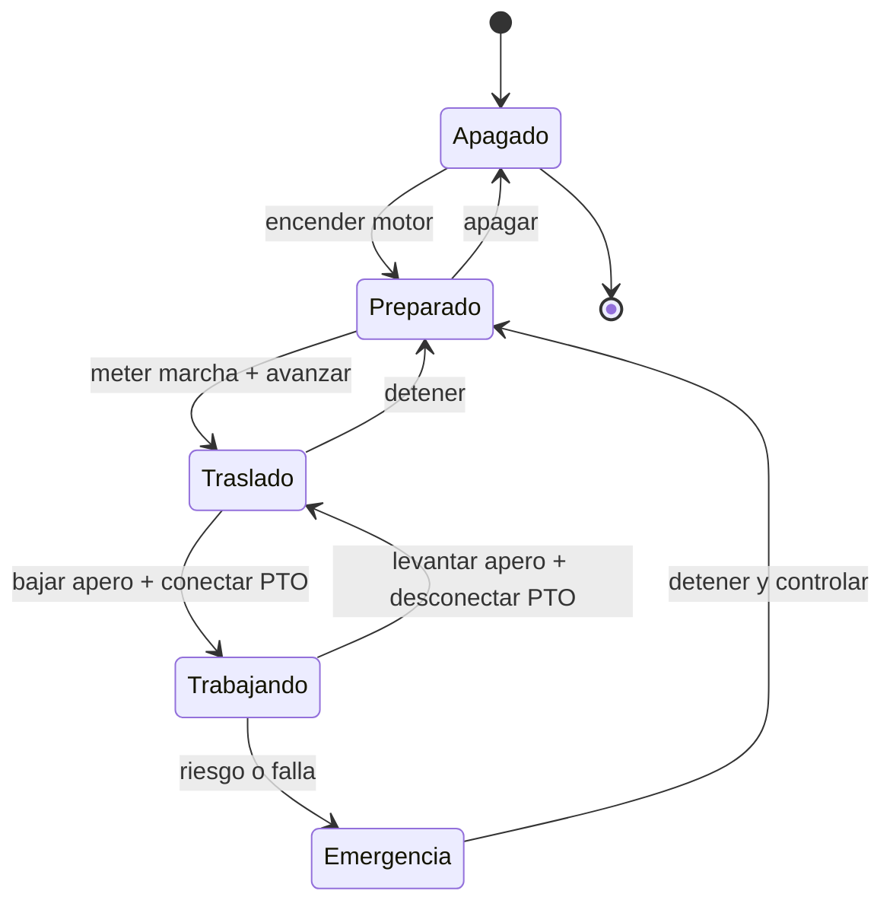

# 🎮 Diseno de simulacion del tractor

[🏠 Inicio](../../../README.md) · [🚜 Curso: Tractores](../README.md) · 🎮 Simulacion

## Objetivo de la simulacion

Que el usuario aprenda a operar un tractor con seguridad: enganchar un apero,
usar la toma de fuerza y la hidraulica del enganche de tres puntos, mantener la
traccion sin patinar en exceso y, sobre todo, conservar la estabilidad en
pendiente evitando el vuelco.

## Nivel de realismo

- Nivel elegido: se ofrece del 1 al 3 (ver `docs/03-niveles-de-realismo.md`).
- Justificacion: el tractor introduce la maquina de trabajo con toma de fuerza y
  enganche, y una fisica de estabilidad delicada, sin la complejidad del izaje de
  una grua.

## Variables principales

| Variable | Tipo | Rango | Afecta a | Comentarios |
| --- | --- | --- | --- | --- |
| Velocidad | numerica | 0-40 km/h | Avance y trabajo | Baja en labranza, media en traslado. |
| Regimen del motor | numerica | 0-2500 rpm | Par y regimen de PTO | Marca 540 o 1000 rpm de la PTO. |
| Marcha | discreta | superreductora..transporte | Fuerza y velocidad | Muchas relaciones de trabajo. |
| Patinaje | numerica | 0-100% | Traccion util | Sube en suelo blando sin lastre. |
| Enganche | numerica | subido..bajado | Profundidad del apero | Control de posicion o esfuerzo. |
| Lastre | numerica | 0-100% | Agarre y estabilidad | Equilibra el apero trasero. |
| Pendiente | numerica | -30..30 grados | Riesgo de vuelco | Factor de estabilidad central. |
| Inclinacion lateral | numerica | -30..30 grados | Vuelco lateral | Critica en ladera. |

## Ciclo basico

1. Leer entrada del usuario (acelerador, frenos, marcha, PTO, enganche, direccion).
2. Actualizar estado del motor, la transmision y la PTO.
3. Calcular fuerzas: traccion, patinaje, tiro del apero, gravedad en pendiente.
4. Aplicar restricciones del entorno (suelo, pendiente, clima, lastre).
5. Actualizar velocidad, posicion, profundidad del apero y estabilidad.
6. Refrescar instrumentos y retroalimentacion (sonido, testigos, avisos de vuelco).

## Modos de juego futuros

- Tutorial guiado de enganche de aperos y uso de la PTO.
- Practica de labranza manteniendo profundidad y regimen constantes.
- Desafios de estabilidad en pendiente sin volcar.
- Misiones de traslado por camino rural respetando la senalizacion.
- Carga y movimiento de material con pala frontal.

## Elementos fuera de alcance

- Presentar la conduccion en pendiente sin ROPS como algo aceptable.
- Trabajar con la PTO sin protector como opcion valida.
- Datos que permitan alterar sistemas reales de la maquina.

## Pendientes

- [ ] Definir valores por defecto de cada variable por tipo de tractor.
- [ ] Prototipar el modelo de traccion y patinaje.
- [ ] Ajustar el modelo de estabilidad y vuelco en pendiente.
- [ ] Agregar fuentes tecnicas publicas a
      [`manuales/fuentes.md`](../../../manuales/fuentes.md).

---

[⬅️ Anterior: Reglamentos](../reglamentos/reglamentos-tractor.md) · [➡️ Siguiente: Recursos](../recursos/recursos-tractor.md)
