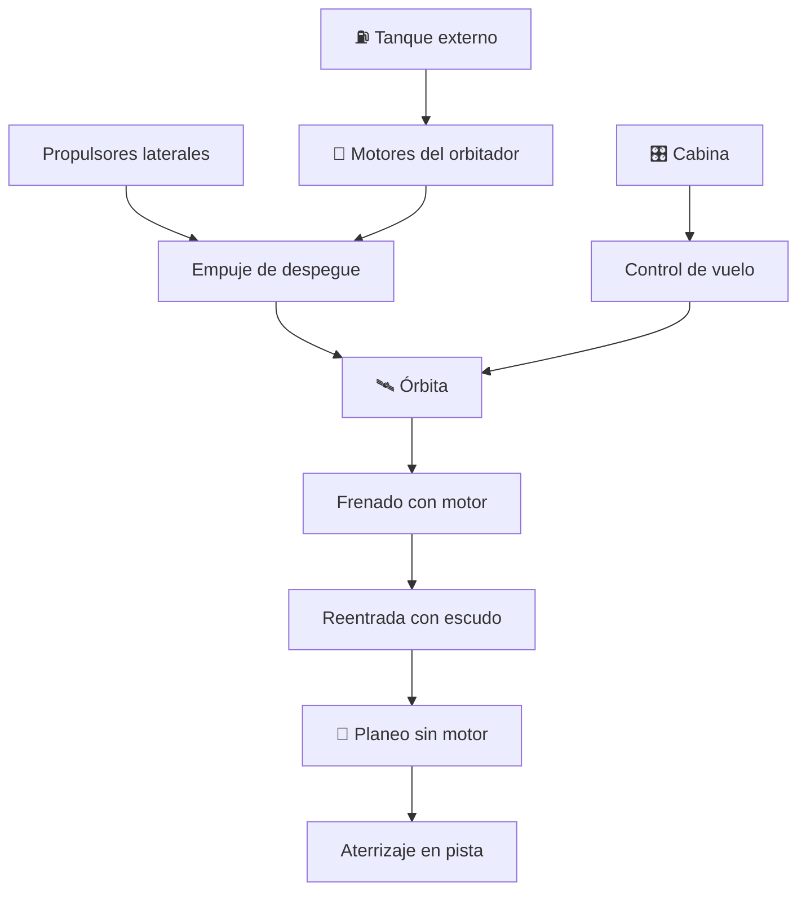

# 🛬 Curso: Transbordadores

[🏠 Inicio](../../README.md) · [🚙 Catálogo de vehículos](../README.md) · [🎓 Guía de curso](../../docs/08-guia-de-estilo-y-curso.md)

> **Curso del vehículo espacial reutilizable con reentrada alada.** Documenta el
> transbordador de principio a fin: historia, características, sistemas
> (orbitador, propulsores, tanque externo, escudo térmico), cabina y mandos,
> física del planeo sin motor en la reentrada, entornos del vuelo, marco legal
> internacional y diseño de simulación. Enfoque **histórico y de principios**.

---

## 🎯 Objetivos de aprendizaje

Al terminar este curso deberías poder:

- Explicar como despega, órbita y reingresa un transbordador reutilizable.
- Identificar el orbitador, los propulsores, el tanque externo y el escudo térmico.
- Comprender por qué la reentrada es un planeo sin motor y cómo se controla.
- Reconocer los mandos e instrumentos de la cabina del orbitador.
- Entender el papel del escudo térmico frente al calor de la reentrada.
- Conocer el marco de tratados espaciales que aplica a la actividad espacial.
- Traducir todo lo anterior en variables de un simulador educativo.

---

## 🗺️ Mapa del vehículo

---

## 📚 Módulos del curso

| # | Módulo | Contenido | Enlace |
| :-: | --- | --- | --- |
| 1 | 📜 Historia | Origen y evolución del transbordador, línea de tiempo. | [Abrir](historia/historia-transbordador.md) |
| 2 | 📋 Características | Que es, sus partes y para que sirve. | [Abrir](operacion/caracteristicas-transbordador.md) |
| 3 | 🔧 Sistemas mecánicos | Orbitador, propulsores, tanque externo, escudo térmico. | [Abrir](operacion/sistemas-mecanicos-transbordador.md) |
| 4 | 🎛️ Mandos e instrumentos | Cabina del orbitador, controles y paneles. | [Abrir](mandos/manual-mandos-transbordador.md) |
| 5 | 🧪 Principios y operación | Reentrada, planeo sin motor y fases de la misión. | [Abrir](operacion/principios-transbordador.md) |
| 6 | 🌍 Entornos de trabajo | Plataforma, ascenso, órbita y reentrada alada. | [Abrir](operacion/entornos-transbordador.md) |
| 7 | ⚖️ Reglamentos | Estado de lanzamiento y tratados espaciales. | [Abrir](reglamentos/reglamentos-transbordador.md) |
| 8 | 🎮 Diseño de simulación | Variables, ciclo y modos de juego. | [Abrir](simulacion/diseno-simulador-transbordador.md) |
| 9 | 🧰 Recursos | Glosario, enlaces y diagramas. | [Abrir](recursos/recursos-transbordador.md) |

---

## 🧩 Requisitos previos

Se recomienda revisar antes el curso de [🚀 cohetes](../cohetes/README.md), que
explica el despegue y el ascenso, y el de
[🚀 naves espaciales](../naves-espaciales/README.md), que introduce la órbita. El
transbordador combina un despegue de cohete con un aterrizaje de avión. Marco
legal común en [⚖️ docs/07-marco-legal-chile.md](../../docs/07-marco-legal-chile.md).

---

[➡️ Empezar por el Módulo 1: Historia](historia/historia-transbordador.md)
