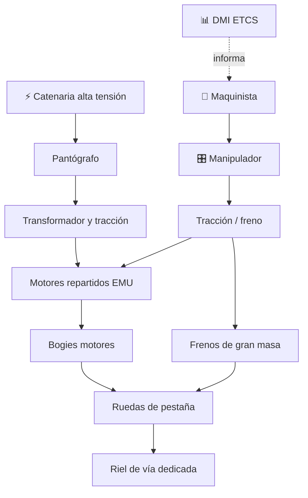

# 🚄 Curso: Tren de alta velocidad

[🏠 Inicio](../../README.md) · [🚙 Catálogo de vehículos](../README.md) · [🎓 Guía de curso](../../docs/08-guia-de-estilo-y-curso.md)

> **Curso del tren de alta velocidad.** Documenta el tren de gran velocidad de
> principio a fin: historia mundial (Shinkansen, TGV, AVE), características,
> mecánica en profundidad, mandos de cabina, física, entornos, marco ferroviario
> y diseño de simulación. Enfoque general e internacional; Chile aún no cuenta
> con alta velocidad comercial.

---

## 🎯 Objetivos de aprendizaje

Al terminar este curso deberías poder:

- Explicar que es un tren de alta velocidad y como acelera, frena y se mantiene estable a más de 250 km/h.
- Distinguir la tracción distribuida (EMU) de la concentrada (locomotora en cabeza).
- Identificar sus sistemas mecánicos y cómo se conectan.
- Comprender el dominio de la resistencia aerodinámica y la enorme energía cinética.
- Reconocer los mandos de cabina y la señalización embarcada ETCS/ERTMS.
- Conocer el marco ferroviario de referencia y marcar lo no confirmado en Chile.
- Traducir todo lo anterior en variables de un simulador educativo.

---

## 🗺️ Mapa del vehículo

---

## 📚 Módulos del curso

| # | Módulo | Contenido | Enlace |
| :-: | --- | --- | --- |
| 1 | 📜 Historia | Origen y expansión mundial de la alta velocidad, línea de tiempo. | [Abrir](historia/historia-tren-alta-velocidad.md) |
| 2 | 📋 Características | Que es, tracción distribuida vs concentrada, tipos y usos. | [Abrir](operacion/caracteristicas-tren-alta-velocidad.md) |
| 3 | 🔧 Sistemas mecánicos | Tracción eléctrica, bogies, frenado, aerodinámica, vía dedicada, señalización. | [Abrir](operacion/sistemas-mecanicos-tren-alta-velocidad.md) |
| 4 | 🎛️ Mandos e instrumentos | Puesto del maquinista, manipulador y pantalla de señalización. | [Abrir](mandos/manual-mandos-tren-alta-velocidad.md) |
| 5 | 🧪 Principios y operación | Energía cinética, frenado en km y estabilidad a alta velocidad. | [Abrir](operacion/principios-tren-alta-velocidad.md) |
| 6 | 🌍 Entornos de trabajo | Corredores de alta velocidad, túneles, viaductos, estaciones. | [Abrir](operacion/entornos-tren-alta-velocidad.md) |
| 7 | ⚖️ Reglamentos | Marco ferroviario: Ley General de Ferrocarriles, EFE, MTT. | [Abrir](reglamentos/reglamentos-tren-alta-velocidad.md) |
| 8 | 🎮 Diseño de simulación | Variables, ciclo y modos de juego. | [Abrir](simulacion/diseno-simulador-tren-alta-velocidad.md) |
| 9 | 🧰 Recursos | Glosario, enlaces y diagramas. | [Abrir](recursos/recursos-tren-alta-velocidad.md) |

---

## 🧩 Requisitos previos

Se recomienda haber revisado antes el curso de motos como base de aceleración,
frenado y transmisión, y conviene entender la gestión de gran masa vista en el
curso de camiones o buses. El tren de alta velocidad es un vehículo avanzado
porque suma la energía cinética enorme, el dominio de la aerodinámica y una vía
dedicada. Marco legal común en
[⚖️ docs/07-marco-legal-chile.md](../../docs/07-marco-legal-chile.md).

---

[➡️ Empezar por el Módulo 1: Historia](historia/historia-tren-alta-velocidad.md)
