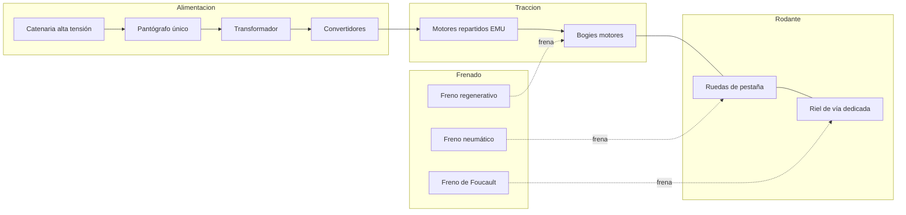
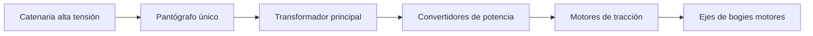
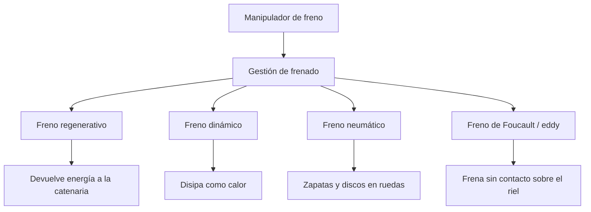
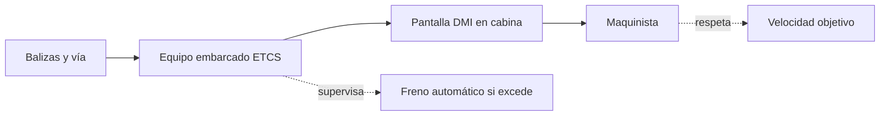

# 🔧 Sistemas mecánicos del tren de alta velocidad

[🏠 Inicio](../../../README.md) · [🚄 Curso: Tren de alta velocidad](../README.md) · 🔧 Sistemas mecánicos

Este módulo abre el tren de alta velocidad por dentro. Explica cada sistema, como
funciona y cómo se conecta con los demás, con foco en la tracción eléctrica de
alta potencia, el frenado de gran masa, la aerodinámica y la vía dedicada. Es la
base técnica para entender los mandos (Módulo 4) y la física (Módulo 5).

---

## 1. ⚡ Tracción eléctrica de alta potencia

El tren no lleva combustible a bordo: toma energía eléctrica de la **catenaria de
alta tensión** mediante un **pantógrafo único** en contacto con el cable. A alta
velocidad se usa un solo pantógrafo activo para reducir el arco eléctrico y el
ruido aerodinámico.

| Componente | Función |
| --- | --- |
| Catenaria | Cable aéreo que lleva la alta tensión a lo largo de la vía. |
| Pantógrafo | Brazo articulado que roza la catenaria y capta la corriente. |
| Transformador | Adapta la tensión de línea a la del tren. |
| Convertidores | Regulan la energía entregada a los motores. |
| Motores de tracción | Convierten la electricidad en giro de los ejes. |

- **Tracción distribuida (EMU)**: los motores se reparten en varios coches. Esto
  mejora la adherencia (más ejes motores) y reparte el esfuerzo.
- **Tracción concentrada**: la potencia se concentra en una locomotora en cabeza
  (y a veces en cola) que remolca coches sin motor.
- **Tensión exacta de línea para Chile**: por confirmar, al no existir red de
  alta velocidad comercial.

---

## 2. 🛞 Bogies y ruedas de pestaña

El **bogie** es el carro con ejes, ruedas y suspensión sobre el que se apoya cada
coche. Las **ruedas de pestaña** guian el tren sobre el riel: la pestaña interior
impide que la rueda se salga y el perfil cónico ayuda a centrar el eje.

| Elemento | Función |
| --- | --- |
| Bogie | Estructura con ejes y suspensión bajo cada coche. |
| Rueda de pestaña | Rueda con reborde que se mantiene sobre el riel. |
| Perfil cónico | Centra el eje y ayuda a tomar curvas. |
| Suspensión primaria | Une eje y bogie, filtra irregularidades del riel. |
| Suspensión secundaria | Une bogie y coche, da confort al pasajero. |

- **Adherencia rueda-riel**: el contacto acero contra acero tiene poca fricción,
  por eso repartir motores (EMU) ayuda a no patinar al acelerar.
- **Estabilidad**: a alta velocidad los bogies deben evitar la oscilación
  llamada movimiento de lazo, con amortiguadores especiales.

---

## 3. 🛑 Frenado de gran masa a alta velocidad

Detener un tren de alta velocidad exige combinar varios frenos, porque la energía
cinética es enorme y la distancia de frenado se mide en kilómetros. El freno solo
de fricción no basta ni disiparía el calor con seguridad.

| Tipo de freno | Como funciona | Nota |
| --- | --- | --- |
| Regenerativo | El motor actua como generador y devuelve energía a la línea. | Ahorra energía y frena sin desgaste. |
| Dinámico | El motor genera electricidad que se disipa como calor. | Útil cuando la línea no admite regeneración. |
| Neumático | Aire comprimido aprieta zapatas o discos en las ruedas. | Freno de fricción clásico, para baja velocidad y parada. |
| Foucault / eddy | Corrientes inducidas frenan sobre el riel sin contacto. | Sin desgaste; útil a alta velocidad. |

- El **freno regenerativo** y el **dinámico** hacen la mayor parte del trabajo a
  alta velocidad; el **neumático** completa la detención final.
- El **freno de Foucault** (corrientes de Foucault o eddy) frena sin tocar la
  rueda, lo que reduce el desgaste en frenadas fuertes.

---

## 4. 🌬️ Aerodinámica

Por encima de 250 km/h la **resistencia del aire domina** sobre las demás fuerzas
de oposición. Por eso la forma del tren importa tanto como su potencia.

| Aspecto aerodinámico | Efecto |
| --- | --- |
| Forma de nariz | Una nariz larga reduce la resistencia y la onda de presión. |
| Resistencia del aire | Crece con el cuadrado de la velocidad; domina a alta velocidad. |
| Ruido | El flujo de aire y el pantógrafo generan ruido que se busca reducir. |
| Túneles | Al entrar a un túnel se crea una onda de presión y un estampido de salida. |
| Onda de presión | La nariz alargada suaviza el golpe de presión al cruzarse trenes o entrar a túneles. |

- La resistencia aerodinámica obliga a carenar bajos, juntas entre coches y el
  propio pantógrafo.
- En **túneles largos** la sección del túnel y la forma del tren definen el
  confort de oidos de los pasajeros.

---

## 5. 🛤️ Vía dedicada y ancho de vía

La alta velocidad necesita una **línea de gran velocidad (LGV)** construida para
ese fin. No comparte los cruces ni las curvas cerradas de una red convencional.

| Elemento de vía | Función |
| --- | --- |
| Radios de curva amplios | Permiten mantener alta velocidad sin fuerza lateral excesiva. |
| Peralte | La vía se inclina en curva para compensar la fuerza centrífuga. |
| Sin pasos a nivel | Elimina cruces con carreteras, principal fuente de riesgo. |
| Vía dedicada (LGV) | Trazado exclusivo para alta velocidad. |
| Ancho de vía | Trocha internacional como referencia; valor exacto para Chile por confirmar. |

- Los **radios de curva amplios** y el **peralte** permiten tomar curvas sin que
  el pasajero sienta fuerza lateral molesta.
- El **ancho de vía** de referencia es la trocha internacional; el valor exacto
  aplicable a Chile queda por confirmar.

---

## 6. 📡 Señalización en cabina ETCS/ERTMS

A alta velocidad el maquinista **no puede leer señales laterales**: pasan
demasiado rápido. La información de circulación se muestra dentro de la cabina.

| Elemento | Función |
| --- | --- |
| ETCS | Sistema europeo de control del tren embarcado. |
| ERTMS | Marco que integra ETCS y comunicaciones. |
| DMI | Pantalla en cabina que muestra la velocidad objetivo. |
| Balizas | Puntos en la vía que informan al tren su posición y límites. |
| Supervisión | Si el tren excede el límite, el sistema frena solo. |

La señalización embarcada supervisa la velocidad y aplica el freno de forma
automática si el maquinista no respeta el límite, lo que es imprescindible a esa
velocidad.

---

## 🔁 Cómo se conecta todo

1. El **pantógrafo** capta la energía de la **catenaria** de alta tensión.
2. El **transformador** y los **convertidores** la adaptan a los **motores**.
3. Los **motores repartidos** mueven los **bogies** y las **ruedas de pestaña**.
4. La **vía dedicada** con curvas amplias y peralte permite mantener la velocidad.
5. La **aerodinámica** reduce la resistencia del aire, que domina a alta velocidad.
6. El **frenado combinado** (regenerativo, dinámico, neumático y de Foucault) detiene la gran masa.
7. La **señalización en cabina** ETCS/ERTMS informa y supervisa la velocidad objetivo.

Con esto entendido, el [Módulo 4: Mandos](../mandos/manual-mandos-tren-alta-velocidad.md)
muestra como el maquinista opera cada uno de estos sistemas.

---

[⬅️ Anterior: Características](caracteristicas-tren-alta-velocidad.md) · [➡️ Siguiente: Mandos e instrumentos](../mandos/manual-mandos-tren-alta-velocidad.md)
